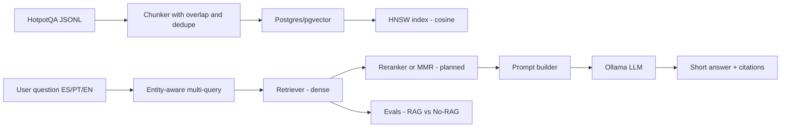
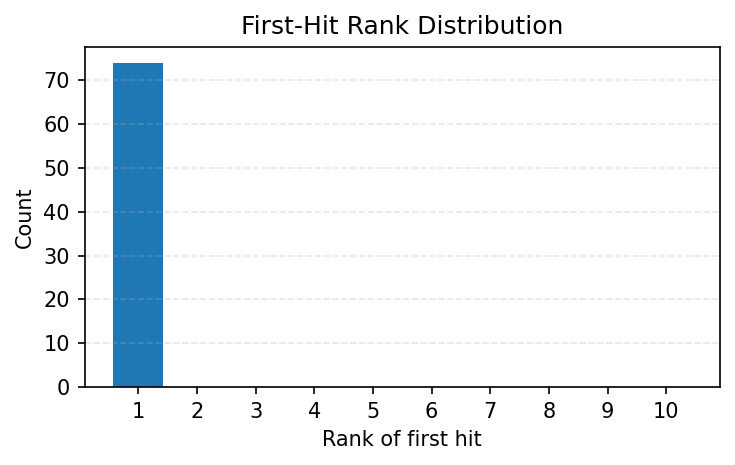
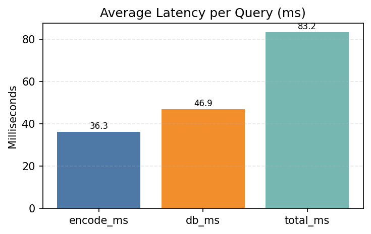
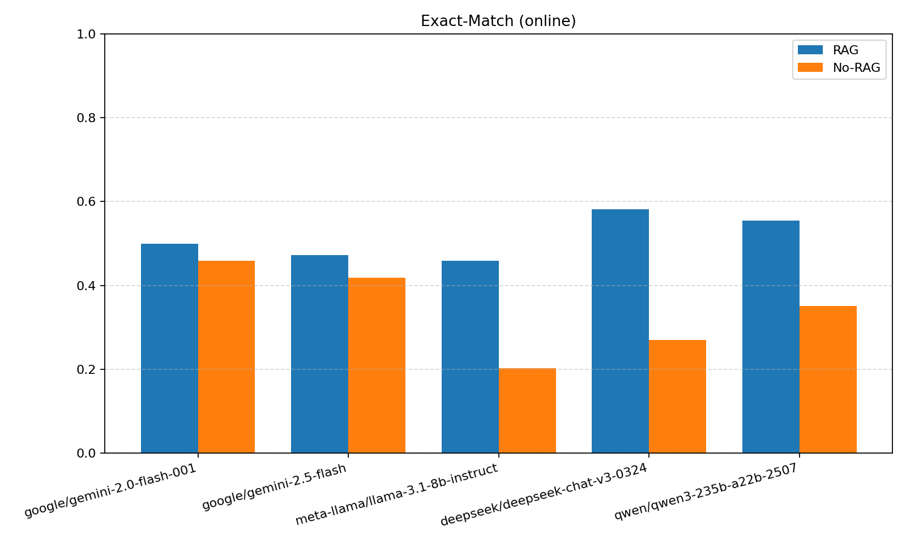
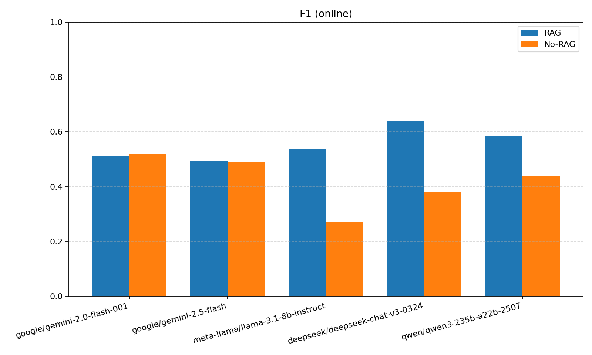
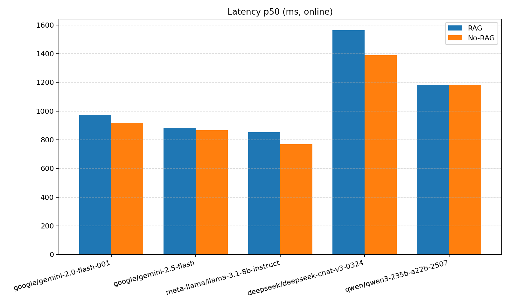
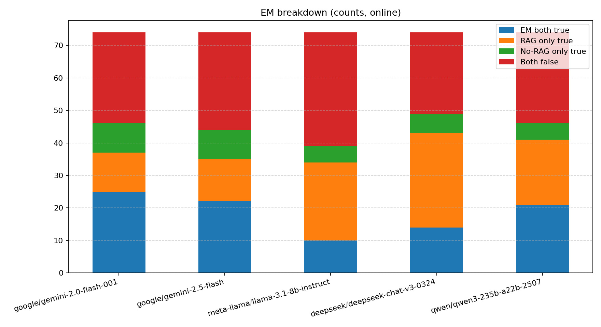
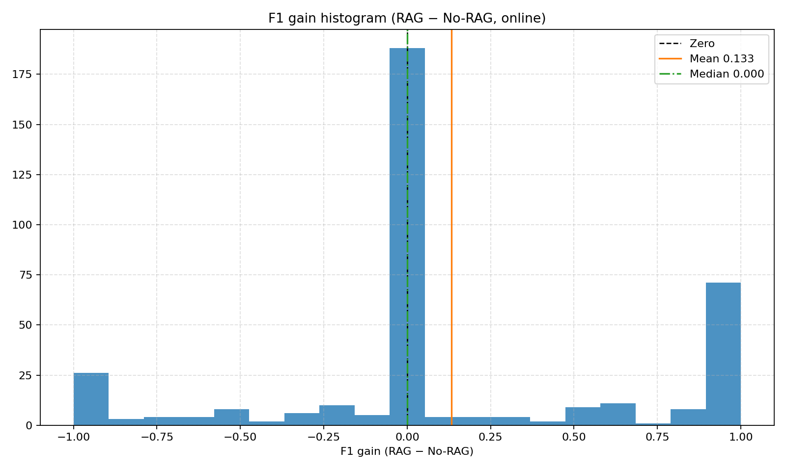

# Multilingual Multi‑Hop RAG (ES/PT/EN)

Local‑first RAG with Postgres + pgvector, BGE‑M3 embeddings on GPU, entity‑aware multi‑query retrieval, and robust Ollama integration. Also supports Pinecone online embeddings + search (integrated path) with health checks and retrieval comparison tooling. Evaluated across multiple local and hosted stacks with side‑by‑side RAG vs No‑RAG plots.

---

Highlights
- Dense retrieval over pgvector HNSW (cosine), normalized embeddings
- Entity‑aware multi‑query retrieval and prompt builder
- Robust short‑answer extraction from reasoning models with “think”‑stripping
- Multilingual ready (ES/PT/EN) via BGE‑M3
- Multi‑model evaluation and plots; error artifacts for deep dives
- Citations and abstention in `/answer` (conservative unknown on weak evidence)

---

Architecture



---

Repository structure

- runtime/
  - data/raw/hotpot/
  - staging/
  - evals_multi/
- scripts/
  - Data pipeline: [scripts/01_download_hotpot.py](scripts/01_download_hotpot.py), [scripts/02_chunk_hotpot.py](scripts/02_chunk_hotpot.py), [scripts/03_load_docs_chunks.py](scripts/03_load_docs_chunks.py), [scripts/04_embed_chunks.py](scripts/04_embed_chunks.py), [scripts/05_create_vector_index.sql](scripts/05_create_vector_index.sql)
  - API: [scripts/api.py](scripts/api.py)
  - Evaluation: [scripts/eval_models.py](scripts/eval_models.py), [scripts/eval_answers.py](scripts/eval_answers.py), [scripts/eval_retrieval.py](scripts/eval_retrieval.py)
  - Tools: [scripts/search.py](scripts/search.py), [scripts/nvidia_verify.py](scripts/nvidia_verify.py)
  - Backends: [scripts/retriever.py](scripts/retriever.py)
  - Embedder: [scripts/embedder.py](scripts/embedder.py)
  - Pinecone: upsert [scripts/04b_upsert_chunks_pinecone.py](scripts/04b_upsert_chunks_pinecone.py), health [scripts/pinecone_health.py](scripts/pinecone_health.py), compare [scripts/run_retrieval_compare.py](scripts/run_retrieval_compare.py)

---

Quickstart

1) Install
- Python 3.10+, CUDA‑capable GPU recommended
- Postgres with pgvector (Docker OK)
- Ollama with local models installed (e.g., qwen3:4b, qwen3:8b, gemma3:1b, gemma3:4b, deepseek-r1:8b)

2) Python dependencies
```bash
pip install -r requirements.txt
```

3) Download Hotpot slice
```bash
python scripts/01_download_hotpot.py
```

4) Chunk and stage
```bash
python scripts/02_chunk_hotpot.py
```

5) Load into Postgres
```bash
python scripts/03_load_docs_chunks.py
```

6) Create vector index (HNSW)
```bash
psql -h localhost -p 5432 -U rag -d ragdb -f scripts/05_create_vector_index.sql
```

7) Embed on GPU (normalized BGE‑M3)
```bash
python scripts/04_embed_chunks.py
```

8) Run API (FastAPI)
```bash
uvicorn scripts.api:app --reload --port 8000
# Health
curl http://127.0.0.1:8000/health
```

---

API

- Health: [python.health()](scripts/api.py:99) → GET /health
- Dense search: [python.search()](scripts/api.py:116) → GET /search?q=...&k=5
- RAG answer (entity‑aware multi‑query + robust Ollama): [python.answer()](scripts/api.py:363)
  - Response includes `citations: [int]` (1‑based source indices) and `latency_ms`.
  - Abstains with `"unknown"` when no source contains the span and top score < `ANSWER_MIN_TOP_SCORE` (default 0.30).

Example
```bash
curl "http://127.0.0.1:8000/search?q=Where%20is%20the%20Random%20House%20Tower%20located%3F&k=5"
curl "http://127.0.0.1:8000/answer?q=Which%20city%20hosts%20the%20Random%20House%20Tower%3F&k=4&model=qwen3:8b"
```

Internals
- Entity extraction: [python.extract_entities()](scripts/api.py:61)
- Multi‑query retrieval merge: [python.search_multi()](scripts/api.py:126)
- Prompt builder: [python.build_prompt()](scripts/api.py:340)
- Robust Ollama call: [python.call_ollama()](scripts/api.py:258)
- FastAPI app instance: [python.app](scripts/api.py:31)

---

CLI search
```bash
python scripts/search.py "Where is the Random House Tower located?" --k 5
```
Entry point: [python.main()](scripts/search.py:81)

Pinecone backend (online embeddings + search)
- Choose Pinecone via env (see `.env.example`): set `RETRIEVER_BACKEND=pinecone`, `EMBEDDING_BACKEND=pinecone`, `EMBEDDING_MODEL=multilingual-e5-large` and `PINECONE_*`.
- Create index with `source_model` and upsert records (online embeddings):
```bash
make pinecone-reindex   # creates index and upserts via upsert_records (online embeddings)
```
- Smoke health check (ensures integrated path works and returns matches):
```bash
make pinecone-health
```
- Use Pinecone for search/API:
```bash
EMBEDDING_BACKEND=pinecone RETRIEVER_BACKEND=pinecone \
  python scripts/search.py "Where is the Random House Tower located?" --k 5
EMBEDDING_BACKEND=pinecone RETRIEVER_BACKEND=pinecone \
  uvicorn scripts.api:app --reload --port 8000
```
- Compare retrieval (local vs Pinecone) with plots/CSVs:
```bash
python scripts/run_retrieval_compare.py \
  --file-en runtime/data/raw/hotpot/hotpot_validation_1pct.jsonl \
  --out-root runtime/evals_multi/retrieval
```

---

Evaluation

Multi‑model RAG vs No‑RAG
```bash
python scripts/eval_models.py --file runtime/data/raw/hotpot/hotpot_validation_1pct.jsonl \
  --sample 100 --models qwen3:4b,gemma3:1b,gemma3:4b,deepseek-r1:8b --write-errors
```
Entry point: [python.main()](scripts/eval_models.py:299)

Online (OpenRouter) RAG vs No‑RAG
```bash
# 1) Put your OpenRouter key in .env (see .env.example)
# 2) Run the online evaluator across several hosted models
python scripts/eval_models_online.py \
  --file runtime/data/raw/hotpot/hotpot_validation_1pct.jsonl \
  --sample 50 --k 4 \
  --models "google/gemini-2.0-flash-001,google/gemini-2.5-flash,deepseek/deepseek-chat-v3-0324:free,qwen/qwen3-30b-a3b" \
  --out-dir runtime/evals_multi --write-errors
```
Outputs mirror the local evaluator (CSV + plots), with files suffixed `_online`.

Retrieval recall@k
```bash
python scripts/eval_retrieval.py --k 5 --limit 50 --file runtime/data/raw/hotpot/hotpot_validation_1pct.jsonl
```
Entry point: [python.main()](scripts/eval_retrieval.py:67)

Plots (recall curves and diagnostics)
```bash
# Generates recall_vs_k.png, hit_rank_hist.png, avg_times_ms.png
python scripts/eval_retrieval.py \
  --k-list 1,5,10 --limit 200 \
  --plot-out runtime/evals_multi/retrieval --save-csv \
  --file runtime/data/raw/hotpot/hotpot_validation_1pct.jsonl
```

RAG vs No‑RAG (single model convenience)
```bash
uvicorn scripts.api:app --port 8000
python scripts/eval_answers.py --limit 50 --k 4 --model qwen3:8b \
  --file runtime/data/raw/hotpot/hotpot_validation_1pct.jsonl
```
Script: [scripts/eval_answers.py](scripts/eval_answers.py)

---

Results (sample plots)

Topline Summary

Local (Ollama)

| Metric | Model | Value | Gain |
| --- | --- | --- | --- |
| Best EM | `qwen3:8b` | 0.432 | +0.283 vs No‑RAG (0.149) |
| Best F1 | `qwen3:8b` | 0.526 | +0.257 vs No‑RAG (0.269) |
| Fastest p50 (RAG) | `gemma3:1b` | 706 ms | +253 ms vs No‑RAG (453 ms) |

Note: Fastest local No‑RAG p50 is `qwen3:4b` at 318 ms.

Online (OpenRouter)

| Metric | Model | Value | Gain |
| --- | --- | --- | --- |
| Best EM | `deepseek/deepseek-chat-v3-0324` | 0.581 | +0.311 vs No‑RAG (0.270) |
| Best F1 | `deepseek/deepseek-chat-v3-0324` | 0.641 | +0.259 vs No‑RAG (0.382) |
| Fastest p50 (RAG) | `meta-llama/llama-3.1-8b-instruct` | 854 ms | +85 ms vs No‑RAG (769 ms) |

Note: Fastest online No‑RAG p50 is `meta-llama/llama-3.1-8b-instruct` at 769 ms.

Exact Match (RAG vs No‑RAG)


In this plot, RAG consistently raises EM across local (Ollama) models. The biggest jumps are for qwen3:8b (~+28 pts EM; 0.149 → 0.432) and gemma3:4b (~+27 pts; 0.135 → 0.405). Smaller models like gemma3:1b see modest EM gains. See aggregate numbers in `runtime/evals_multi/model_summaries.csv`.

F1 (RAG vs No‑RAG)


Average F1 gains are positive for most local models: qwen3:8b (+0.257), gemma3:4b (+0.253), qwen3:4b (+0.174), deepseek-r1:8b (+0.101). gemma3:1b is roughly flat (−0.002), reflecting capacity limits rather than retrieval issues.

Latency p50


Offline runs are snappy: ~0.7–1.9 s p50 end‑to‑end with RAG, adding ~0.2–0.6 s over No‑RAG (retrieval + longer contexts). This remains interactive on a single GPU.

EM breakdown (counts)


RAG‑only correctness dominates across models (e.g., qwen3:8b has 23 RAG‑only vs 2 No‑RAG‑only). Retrieval reduces misses more often than it introduces regressions.

F1 gain histogram (RAG − No‑RAG)


The distribution skews positive with a large mass at zero. Many questions remain unchanged; a healthy slice improves with RAG; a smaller tail regresses, typically around boundary/normalization mismatches.

Per‑model F1 gains


qwen3:8b and gemma3:4b benefit most from retrieval; gemma3:1b remains largely unchanged.

Retrieval (Recall@k)


Local pgvector + BGE‑M3 reaches ~0.93–0.97 top‑1 recall and 1.00 by top‑5 on the multilingual slice (EN/ES/PT). Increasing k beyond 5 shows no gain for this dataset size.

Hit rank distribution and latency breakdown



Most hits land at rank 1 with a small tail at ranks 2–3. Latency‑wise, local retrieval averages ~52–57 ms end‑to‑end (≈40 ms embed + ≈13 ms DB).

Online Results (OpenRouter)

Exact Match (RAG vs No‑RAG)


Online LLMs outperform local ones on EM. Deepseek‑chat‑v3 and llama‑3.1‑8b‑instruct show large RAG EM lifts (~+26–31 pts). Gemini models have strong No‑RAG baselines; RAG improves EM modestly.

F1 (RAG vs No‑RAG)


RAG provides large F1 gains for deepseek‑chat‑v3 (+0.259) and llama‑3.1‑8b‑instruct (+0.265). qwen‑235b gains +0.144. Gemini models change little on F1 (−0.007 to +0.005), indicating their built‑in knowledge already covers much of the slice.

Latency p50 (online)


Median online latencies are ~0.85–1.56 s, comparable to local, but tails are longer for the largest models (e.g., qwen‑235b p95 ≈ 5.1 s). Network + provider queueing drives the long tail.

EM breakdown (online)


RAG‑only wins exceed No‑RAG‑only across hosted models as well, echoing local trends.

F1 gain histogram (online)


Distribution skews positive with a sizeable zero‑mass; improvements are most pronounced on multi‑entity and factoid questions.

Retrieval: Local vs Pinecone (trade‑offs)

- Top‑1 recall: Pinecone achieves 1.00 across EN/ES/PT on the tested slice, while local sits at ~0.93–0.97; both hit 1.00 by k=5.
- Latency: Local retrieval averages ~52–57 ms total. Pinecone averages ~315–324 ms (remote call), ~6× slower but still fast in absolute terms.
- Multilingual overlap: Local EN↔ES/EN↔PT Jaccard overlaps are moderate (≈0.43–1.0) with ES↔PT often highest. Pinecone is frequently 1.0 but not universally so, indicating small ranking drifts.
- Practical take: For demos and tight SLAs, local retrieval is very responsive and saturates by k=5. For highest precision at k=1, Pinecone edges out on this slice at a consistent latency cost.

Pinecone health (smoke)
```bash
# Runs a few queries and prints top results; warns if zero matches
python scripts/pinecone_health.py --n 5 --k 5
```

Multilingual retrieval (EN/ES/PT)
```bash
# Check cross-lingual retrieval consistency via Jaccard overlap
python scripts/eval_multilingual_retrieval.py \
  --k 5 --limit 3 \
  --out-dir runtime/evals_multi/retrieval --save-csv
```
Plot: 

Multilingual eval set (10 examples)
```bash
# 1) Ensure you have OPENROUTER_API_KEY in .env
# 2) Generate a 10-example multilingual JSONL (EN/ES/PT per example)
python scripts/make_multilingual_eval_set.py \
  --in-file runtime/data/raw/hotpot/hotpot_validation_1pct.jsonl \
  --out-file runtime/data/raw/hotpot/hotpot_multilingual_10.jsonl \
  --n 10 --seed 42 --model google/gemini-2.0-flash-001

# 3) Use this file for retrieval and answer evaluations (works with existing scripts)
python scripts/eval_retrieval.py --k 5 --limit 30 --file runtime/data/raw/hotpot/hotpot_multilingual_10.jsonl
python scripts/eval_models_online.py --file runtime/data/raw/hotpot/hotpot_multilingual_10.jsonl \
  --sample 30 --k 4 --models "google/gemini-2.0-flash-001,google/gemini-2.5-flash,deepseek/deepseek-chat-v3-0324:free,qwen/qwen3-30b-a3b" \
  --out-dir runtime/evals_multi --write-errors
```

Aggregate CSVs
- Local: [runtime/evals_multi/model_summaries.csv](runtime/evals_multi/model_summaries.csv)
- Online: [runtime/evals_multi/online/model_summaries_online.csv](runtime/evals_multi/online/model_summaries_online.csv)

---

Design choices
- BGE‑M3 for multilingual embeddings (ES/PT/EN), normalized vectors
- pgvector HNSW for cosine; SKIP LOCKED windowing for safe parallel embedding
- Entity‑aware multi‑query retrieval to improve recall on multi‑hop questions
- Robust short‑answer extraction from Ollama outputs (schema + heuristic)

---

Roadmap (planned next)
- Hybrid retrieval: add BM25 + RRF blending
- Cross‑encoder reranker with optional MMR
- Citations in /answer and abstention on low evidence
- Streamlit demo UI with screenshots/gif
- Docker Compose (pgvector + API), connection pooling, structured logs
- RAGAS metrics; multilingual eval slice

---

Acknowledgments
- HotpotQA dataset
- pgvector, FastAPI, Ollama, SentenceTransformers, BGE‑M3

---

Developer shortcuts and compose

Makefile
```bash
# One-time
make venv && make install

# Start Postgres (pgvector)
make db-up

# End-to-end pipeline and API
make pipeline
make api

# Lint/format and tests
make lint
make format
make test

# Pinecone (online embeddings + search)
make pinecone-reindex
make pinecone-health
```

Docker Compose
- `docker-compose.yml` provides a `db` service using `pgvector/pgvector:pg16` with defaults
  matching `.env.example` (DB `ragdb`, user `rag`, password `rag`).

API response additions
- `/answer` now includes `citations: [int]` (1-based indices of sources containing the
  predicted span) and abstains with `"unknown"` when evidence is weak (no span matches
  and top similarity below `ANSWER_MIN_TOP_SCORE`, default 0.30).

Tests
- Minimal tests available:
  - `tests/test_api_health.py`
  - `tests/test_entities_and_utils.py`
  - `tests/test_retriever_pool.py`
Run with `make test`.
