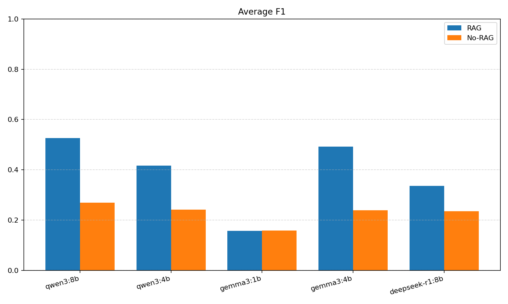
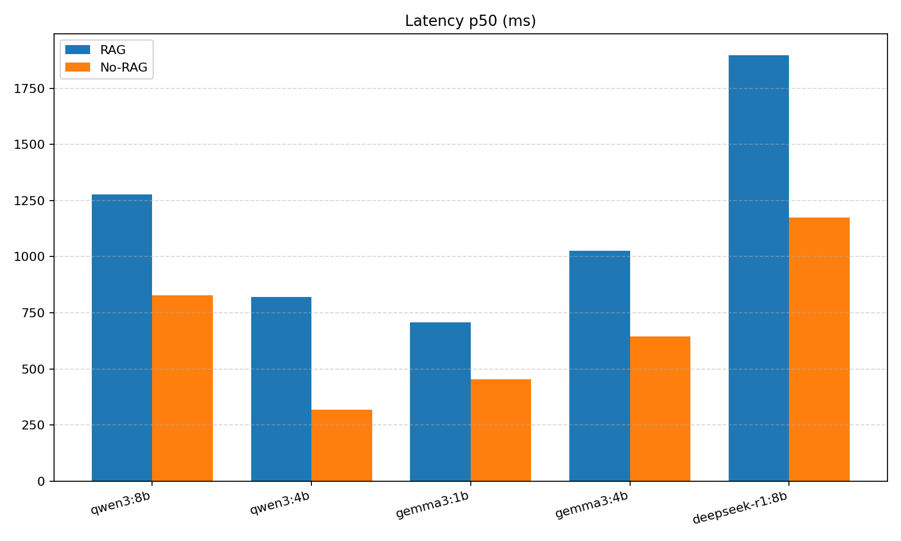

# Multilingual Multi‑Hop RAG (ES/PT/EN)

Local‑first RAG with Postgres + pgvector, BGE‑M3 embeddings on GPU, entity‑aware multi‑query retrieval, and robust Ollama integration. Evaluated across multiple local LLMs with side‑by‑side RAG vs No‑RAG plots.

---

Highlights
- Dense retrieval over pgvector HNSW (cosine), normalized embeddings
- Entity‑aware multi‑query retrieval and prompt builder
- Robust short‑answer extraction from reasoning models with “think”‑stripping
- Multilingual ready (ES/PT/EN) via BGE‑M3
- Multi‑model evaluation and plots; error artifacts for deep dives

---

Architecture


---

Repository structure

- runtime/
  - data/raw/hotpot/
  - staging/
  - evals_multi/
- scripts/
  - Data pipeline: [scripts/01_download_hotpot.py](scripts/01_download_hotpot.py), [scripts/02_chunk_hotpot.py](scripts/02_chunk_hotpot.py), [scripts/03_load_docs_chunks.py](scripts/03_load_docs_chunks.py), [scripts/04_embed_chunks.py](scripts/04_embed_chunks.py), [scripts/05_create_vector_index.sql](scripts/05_create_vector_index.sql)
  - API: [scripts/api.py](scripts/api.py)
  - Evaluation: [scripts/eval_models.py](scripts/eval_models.py), [scripts/eval_answers.py](scripts/eval_answers.py), [scripts/eval_retrieval.py](scripts/eval_retrieval.py)
  - Tools: [scripts/search.py](scripts/search.py), [scripts/nvidia_verify.py](scripts/nvidia_verify.py)

---

Quickstart

1) Install
- Python 3.10+, CUDA‑capable GPU recommended
- Postgres with pgvector (Docker OK)
- Ollama with local models installed (e.g., qwen3:4b, qwen3:8b, gemma3:1b, gemma3:4b, deepseek-r1:8b)

2) Python dependencies
```bash
pip install -r requirements.txt
```

3) Download Hotpot slice
```bash
python scripts/01_download_hotpot.py
```

4) Chunk and stage
```bash
python scripts/02_chunk_hotpot.py
```

5) Load into Postgres
```bash
python scripts/03_load_docs_chunks.py
```

6) Create vector index (HNSW)
```bash
psql -h localhost -p 5432 -U rag -d ragdb -f scripts/05_create_vector_index.sql
```

7) Embed on GPU (normalized BGE‑M3)
```bash
python scripts/04_embed_chunks.py
```

8) Run API (FastAPI)
```bash
uvicorn scripts.api:app --reload --port 8000
# Health
curl http://127.0.0.1:8000/health
```

---

API

- Health: [python.health()](scripts/api.py:99) → GET /health
- Dense search: [python.search()](scripts/api.py:116) → GET /search?q=...&k=5
- RAG answer (entity‑aware multi‑query + robust Ollama): [python.answer()](scripts/api.py:363)

Example
```bash
curl "http://127.0.0.1:8000/search?q=Where%20is%20the%20Random%20House%20Tower%20located%3F&k=5"
curl "http://127.0.0.1:8000/answer?q=Which%20city%20hosts%20the%20Random%20House%20Tower%3F&k=4&model=qwen3:8b"
```

Internals
- Entity extraction: [python.extract_entities()](scripts/api.py:61)
- Multi‑query retrieval merge: [python.search_multi()](scripts/api.py:126)
- Prompt builder: [python.build_prompt()](scripts/api.py:340)
- Robust Ollama call: [python.call_ollama()](scripts/api.py:258)
- FastAPI app instance: [python.app](scripts/api.py:31)

---

CLI search
```bash
python scripts/search.py "Where is the Random House Tower located?" --k 5
```
Entry point: [python.main()](scripts/search.py:81)

---

Evaluation

Multi‑model RAG vs No‑RAG
```bash
python scripts/eval_models.py --file runtime/data/raw/hotpot/hotpot_validation_1pct.jsonl \
  --sample 100 --models qwen3:4b,gemma3:1b,gemma3:4b,deepseek-r1:8b --write-errors
```
Entry point: [python.main()](scripts/eval_models.py:299)

Online (OpenRouter) RAG vs No‑RAG
```bash
# 1) Put your OpenRouter key in .env (see .env.example)
# 2) Run the online evaluator across several hosted models
python scripts/eval_models_online.py \
  --file runtime/data/raw/hotpot/hotpot_validation_1pct.jsonl \
  --sample 50 --k 4 \
  --models "google/gemini-2.0-flash-001,google/gemini-2.5-flash,deepseek/deepseek-chat-v3-0324:free,qwen/qwen3-30b-a3b" \
  --out-dir runtime/evals_multi --write-errors
```
Outputs mirror the local evaluator (CSV + plots), with files suffixed `_online`.

Retrieval recall@k
```bash
python scripts/eval_retrieval.py --k 5 --limit 50 --file runtime/data/raw/hotpot/hotpot_validation_1pct.jsonl
```
Entry point: [python.main()](scripts/eval_retrieval.py:67)

Plots (recall curves and diagnostics)
```bash
# Generates recall_vs_k.png, hit_rank_hist.png, avg_times_ms.png
python scripts/eval_retrieval.py \
  --k-list 1,5,10 --limit 200 \
  --plot-out runtime/evals_multi/retrieval --save-csv \
  --file runtime/data/raw/hotpot/hotpot_validation_1pct.jsonl
```

RAG vs No‑RAG (single model convenience)
```bash
uvicorn scripts.api:app --port 8000
python scripts/eval_answers.py --limit 50 --k 4 --model qwen3:8b \
  --file runtime/data/raw/hotpot/hotpot_validation_1pct.jsonl
```
Script: [scripts/eval_answers.py](scripts/eval_answers.py)

---

Results (sample plots)

Exact Match (RAG vs No‑RAG)


F1 (RAG vs No‑RAG)


Latency p50


EM breakdown (counts)


F1 gain histogram (RAG − No‑RAG)


Per‑model F1 gains


Retrieval (Recall@k)


Multilingual retrieval (EN/ES/PT)
```bash
# Check cross-lingual retrieval consistency via Jaccard overlap
python scripts/eval_multilingual_retrieval.py \
  --k 5 --limit 3 \
  --out-dir runtime/evals_multi/retrieval --save-csv
```
Plot: 

Multilingual eval set (10 examples)
```bash
# 1) Ensure you have OPENROUTER_API_KEY in .env
# 2) Generate a 10-example multilingual JSONL (EN/ES/PT per example)
python scripts/make_multilingual_eval_set.py \
  --in-file runtime/data/raw/hotpot/hotpot_validation_1pct.jsonl \
  --out-file runtime/data/raw/hotpot/hotpot_multilingual_10.jsonl \
  --n 10 --seed 42 --model google/gemini-2.0-flash-001

# 3) Use this file for retrieval and answer evaluations (works with existing scripts)
python scripts/eval_retrieval.py --k 5 --limit 30 --file runtime/data/raw/hotpot/hotpot_multilingual_10.jsonl
python scripts/eval_models_online.py --file runtime/data/raw/hotpot/hotpot_multilingual_10.jsonl \
  --sample 30 --k 4 --models "google/gemini-2.0-flash-001,google/gemini-2.5-flash,deepseek/deepseek-chat-v3-0324:free,qwen/qwen3-30b-a3b" \
  --out-dir runtime/evals_multi --write-errors
```

Aggregate CSV
- [runtime/evals_multi/model_summaries.csv](runtime/evals_multi/model_summaries.csv)

---

Design choices
- BGE‑M3 for multilingual embeddings (ES/PT/EN), normalized vectors
- pgvector HNSW for cosine; SKIP LOCKED windowing for safe parallel embedding
- Entity‑aware multi‑query retrieval to improve recall on multi‑hop questions
- Robust short‑answer extraction from Ollama outputs (schema + heuristic)

---

Roadmap (planned next)
- Hybrid retrieval: add BM25 + RRF blending
- Cross‑encoder reranker with optional MMR
- Citations in /answer and abstention on low evidence
- Streamlit demo UI with screenshots/gif
- Docker Compose (pgvector + API), connection pooling, structured logs
- RAGAS metrics; multilingual eval slice

---

Acknowledgments
- HotpotQA dataset
- pgvector, FastAPI, Ollama, SentenceTransformers, BGE‑M3
